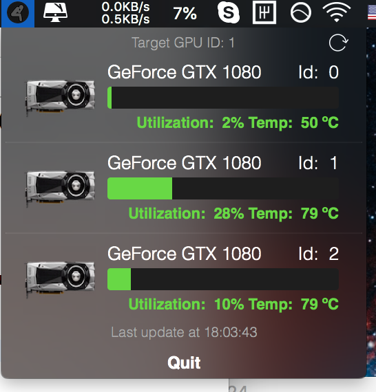

# Nvidia monitor app (OSX app for monitoring Nvidia GPU via SSH Connection)

## Description

The main purpose of this util is to monitor remote GPU's parameters: utilization and temperature. The update is done via SSH Connection. In order to get the app working edit ``` Definitios.swift ``` with valid ``` user_id ```, ``` host_address ``` and ``` password ```. Accessing with rsa key currently **not** available.

## Interface

The status is updated every **5** minutes, it's posible to change ``` update_rate ``` in the ``` Definitios.swift ``` file.
<p align="center">

</p>

The app is responsive for the updates and the icon reflects the status. There are several possible states:  
  
  
 – The GPU is availble  
 – The App is loading info  
 – GPU occupied, you have to wait (use force Update in the top right corner, maybe get some tea :)  
 – Something wrong with connection, definitely use force update  


## NOTE!  
In order to receive updates from the server, the remote machine has to support ``` nvidia-smi ```  interface, because information fetching relies on it.


